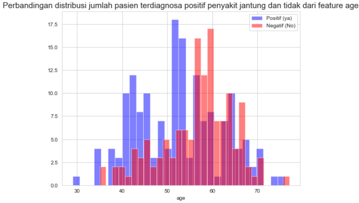

# Machine Learning Project
Salah satu project yang dilakukan pada masa studi program Job Connector Data Science Purwadhika

#
# Tentang Project
Sumber data dari project yang dilakukan adalah dataset dari Kaggle tentang record pasien yang memiliki penyakit jantung dan tidak. Record berisi kondisi fisik hasil pemeriksaan pasien, yaitu sbb:

1. Usia - Age
2. Gender - Sex
3. Nyeri dada - Chest pain(asymptomatis, nonanginal, nontypical)
4. Gula darah pada saat istirahat - Resting blood pressure
5. Kolesterol - Chol (mg/l)
6. Fasting blood sugar - gula darah puasa, apakah lebih besar dari 120 mg/L atau tidak
7. Hasil tes electrocardiographic pada saat istirahat - Resting electrocardiographic results
8. Denyut Jantung Maximum - Max heart rate
9. Exercise induced angina (1: ya, 0: tidak)
10. Oldpeak - ST depression induced by exercise relative to rest
11. Slope - Slope of the peak exercise ST Segment
12. Jumlah pembuluh darah utama berubah warna pada fluoroscopy - Ca (0 - 3)
13. Thalasemia - Thal (3: normal, 6: cacat permanen, 7: cacat reversible/non permanen)
14. **Kolom target**: Diagnosa penyakit jantung (1: ya, 0: tidak)

#
# Dataset

#
# Problem Statement
Dalam kondisi pandemi seperti saat ini, rumah sakit memiliki kesibukan ekstra karena harus menghandle pasien suspect Covid-19 dan menghadapi penyakit2 penyertanya. Oleh karena itu, dokter dan tenaga kesehatan membutuhkan bantuan untuk mendiagnosa pasien dengan tingkat akurasi tinggi, sehingga dokter-dokter dapat fokus merawat pasien-pasien yang memang butuh perawatan. Algoritma Machine Learning diharapkan mampu membantu proses diagnosa keberadaan penyakit jantung pada pasien dengan tingkat akurasi yang baik.

#
# Project Goals:
1. Menentukan faktor-faktor yang mempengaruhi seseorang memiliki penyakit jantung/tidak
2. Dari dataset, menentukan kecenderungan faktor usia dalam mempengaruhi seseorang memiliki penyakit jantung
3. Menentukan algoritma Machine Learning untuk proses diagnosa pasien berpenyakit jantung ==> Hasil diagnosa yang dihindari adalah False Negatif: dimana seorang pasien sebenarnya memiliki penyakit jantung, namun hasil diagnosa menyatakan tidak memiliki penyakit jantung. Oleh karena itu, evaluasi yang dipertimbangkan dalam pembuatan model machine learning adalah Recall

#
# Data Visualization

## Distribusi usia pasien terhadap hasil diagnosa penyakit jantung

## Distribusi tingkat kolesterol pasien terhadap hasil diagnosa penyakit jantung

#
# Machine Learning Model
Algoritma Machine Learning Model yang digunakan merupakan jenis classifier, yaitu: Logistic Regression, KNearest Neighbors, dan Random Forest terhadap semua fitur. Kemudian hasil evaluasi model dibandingkan dengan model dengan hyperparameter tuning pada algoritma model yang sama. Pada proses fitting model menggunakan hyperparameter tuning, dilakukan feature selection menggunakan SelectKBest dengan metode chi2.

## Hasil feature selection menggunakan SelectKBest

## Evaluation Summary

#
# Kesimpulan
1. Berdasarkan feature importance dari uji chi2 (chi square) dan heatmap korelasi, feature-feature yang berpengaruh terhadap diagnosa penyakit jantung antara lain:
    * thalach   - kondisi talasemia (kelainan dalam keping darah)
    * ca        - hasil fluoroscopy terhadap pembuluh darah
    * oldpeak   - ST depression yang dihasilkan dari pemeriksaan setelah berolahraga
    * cp - chestpain (nyeri dada)
    * ExAng - kondisi pembuluh darah dari pemeriksaan setelah berolahraga
    * age - usia
    * chol - kolesterol darah
2. Faktor usia cukup berkorelasi terhadap risiko seseorang memiliki penyakit jantung, namun hal ini juga ditentukan oleh faktor-faktor lain seperti thalasemia, kondisi pembuluh darah, dll yang sudah disebutkan pada poin pertama.
3. Model yang menunjukkan nilai recall dan tingkat akurasi yang paling baik diantara model-model yang sudah dicoba adalah model KNearest Neighbors tanpa parameter tuning dengan jumlah n_neighbors = 3 dan menggunakan StandardScaler. Hal ini karena model ini mampu memberikan prediksi False Negative paling minim.
4. Model ini sangat bermanfaat bagi tenaga kesehatan di rumah sakit maupun fasilitas kesehatan lainnya. Hal ini karena model mampu mempersingkat proses diagnosa pasien berdasarkan data historisnya, sehingga jumlah pasien yang akan dilakukan pemeriksaan lebih lanjut oleh tenaga kesehatan sudah tersortir dari seluruh pasien yang memiliki keluhan tentang kondisi jantungnya. Terlebih di masa pandemi ini, dimana beban rumah sakit dan tenaga kesehatan berpotensi overload, penggunaan model machine learning mampu mengurangi beban tenaga kesehatan, khususnya dokter untuk mendiagnosa pasien.

#
# Saran
Dibutuhkan pemeriksaan lebih lanjut dan menyeluruh oleh tenaga kesehatan (khususnya dokter spesialis jantung), serta treatment yang tepat terhadap pasien yang masuk kategori memiliki penyakit jantung (berdasarkan model algoritma machine learning yang telah dibuat).

#
# Dashboard
